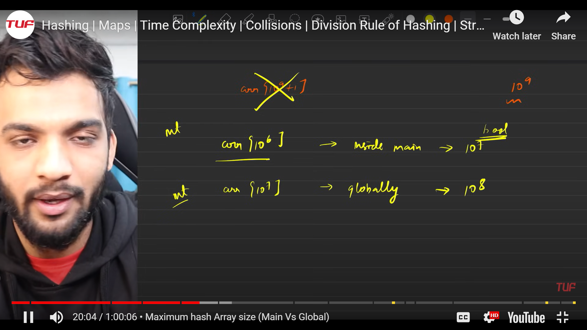

## Allocation of hasing can be done as per the image specification in locally or globally for int and bool

### Character hashing algorithm 

## Since array hashing cannot be done for the numbers greater than 10^7 maps are used

### Maps are of two types : 

#### Ordered maps -> Stores in sorted order
#### Unordered maps -> Stores in unordered order

Time Complexity : 

## Tips : Unordered maps must be used, if in case an TLE occurs due to internal collision then ordered map should be used